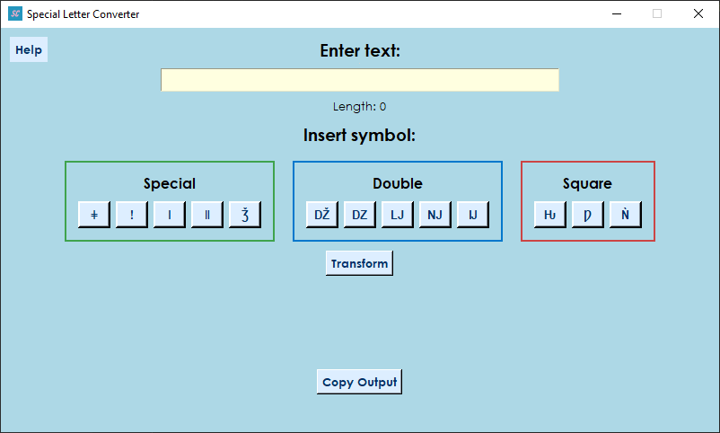

# 🧿 Symbol Converter – For Fancy BattleTags

**Symbol Converter** is a lightweight desktop app made specifically for creating **stylish BattleTags** that stay within **Blizzard’s naming restrictions**.
It lets you transform standard letters into unique symbols, view character variants, and insert them where needed — all while ensuring your final name is **valid for use on Battle.net**.

---

## ⚔️ Why Use This for BattleTags?

Blizzard restricts BattleTags to:

* ✅ Letters and numbers only (no special characters like `!@#`).
* ✅ 3–12 characters in total.
* ✅ Cannot start with a number.

All symbol variants in this tool are valid **Unicode alternatives** of standard characters — making them **100% acceptable** by Blizzard's system but still **visually unique**.

---

## 🛠 Features

* 🔤 **Transform Characters** – Turn letters into cool Unicode equivalents.
* 🔎 **View Symbol Variants** – Type a single letter to explore all valid symbol options.
* 🧩 **Insert Symbols** – Tap any variant to add it at the current cursor position.
* ✅ **Live Input Validation** – Limits input to 30 characters, disallows spaces, special characters, and numeric start.
* 📋 **One-Click Copy** – Quickly copy your styled BattleTag.
* 🆘 **Help Button** – A simple popup explains how everything works.

---

## 💡 How to Use

1. **Type** your BattleTag idea — max 30 characters.
   ⚠️ Spaces, special characters like `@`, and numeric starts are not allowed (Blizzard restriction: 3–12 characters).

2. To find cool **symbol variants**, type a **single letter** and click **Transform**.

3. Use the **Insert section** to add symbols to your BattleTag exactly where you want.

4. Click **Transform** again to convert your full tag with inserted symbols.

5. Click **Copy** to get your BattleTag ready to paste into Battle.net.

---

## 📦 Installation

1. Download the latest release `.exe` from the **[Releases](https://github.com/yourusername/SymbolConverter/releases)** section.
2. Run `setup.exe` and follow the steps to install the app.

---

